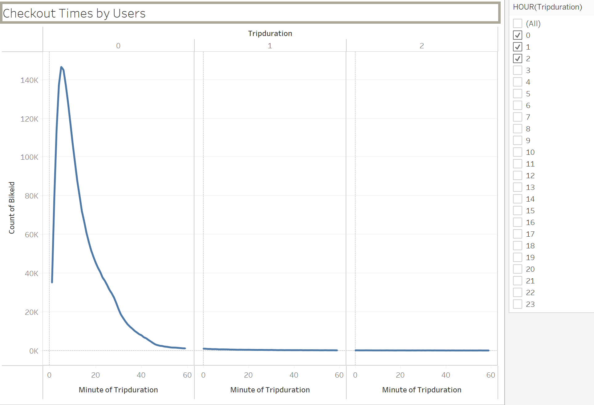
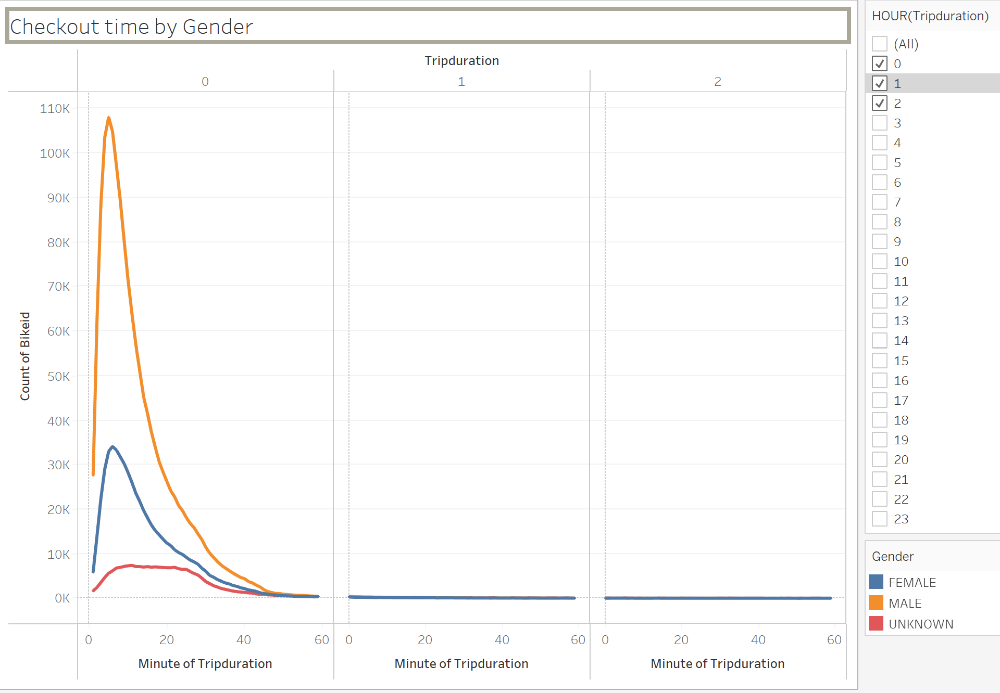
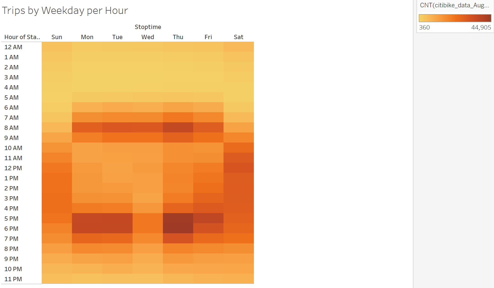
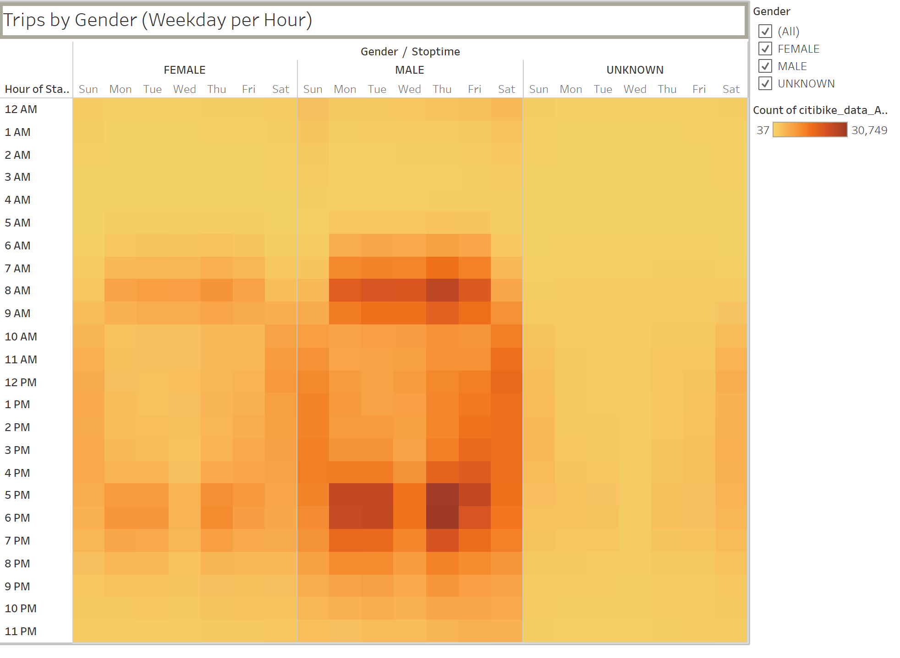
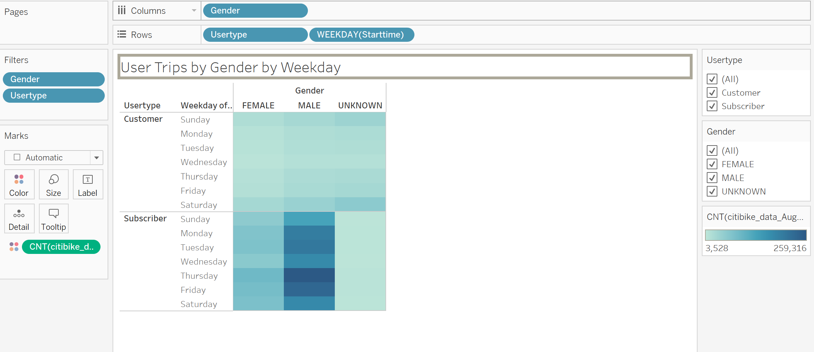
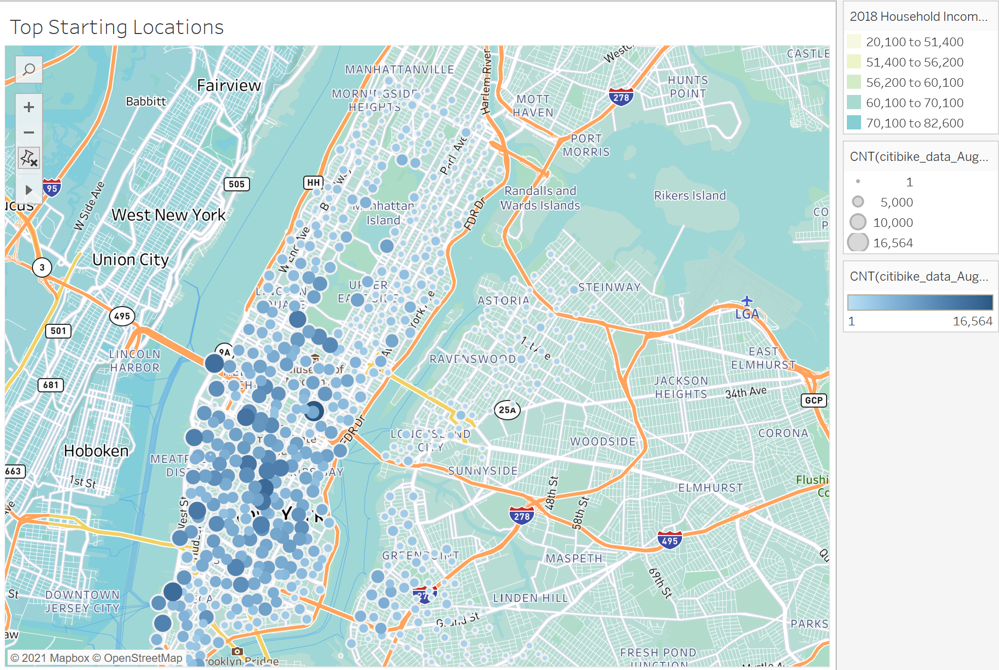
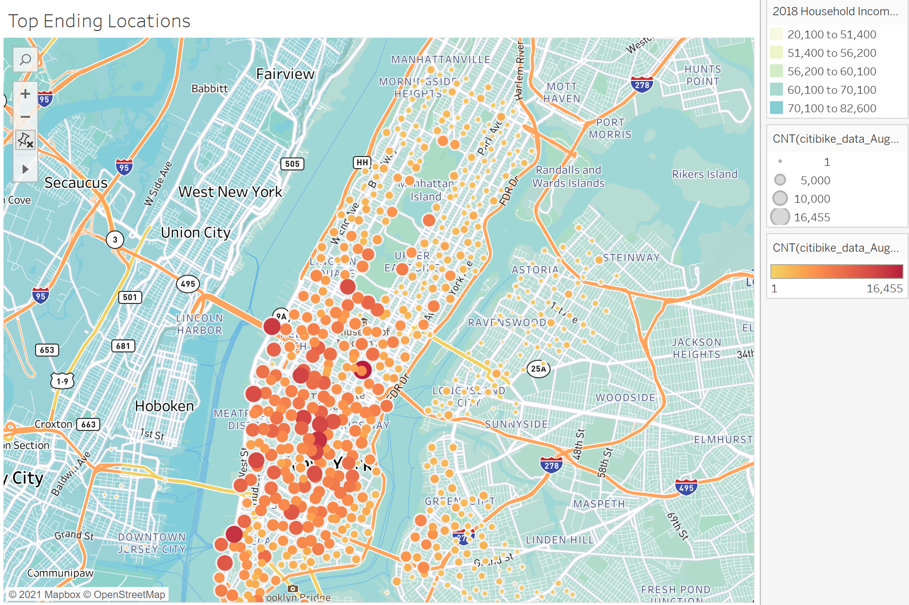
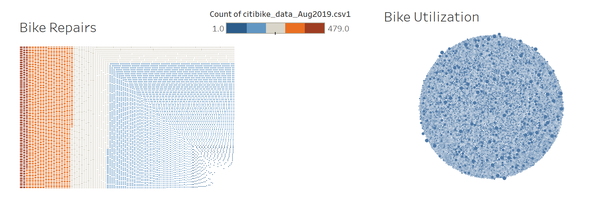
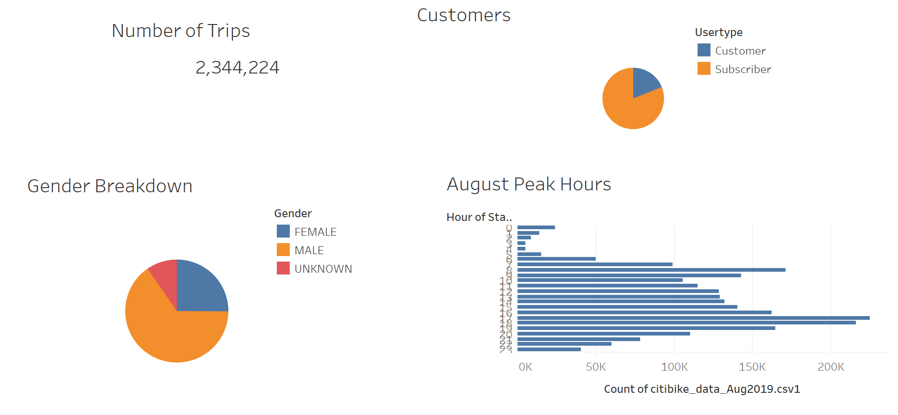

# Bikesharing
# Overview of the statistical analysis:
Analysis of bike sharing business of New York using tools such as Tableau in order to form basis of a business plan for bike sharing business in Des Moines.

Below is the link for the Tableau workbook on tableau public :

[Link to the Story] https://public.tableau.com/app/profile/lavina.jagwani/viz/Citibike_Challenge_16373667360710/SummaryofNYC_Citibike_AnalysisVisualization

## Purpose :
The citibike bike sharing business is very popular in cities providing the convenience of exploring the city, especially in high traffic within a short time. Due to its immense popularity, this analysis is done on the citi-bike data of NYC to understand the business in a greater depth and to be able to take and informed decision of opening a similar bike sharing business in the city of Des Moines, Iowa.

## Basic Project Plan :
We have used the data of citibike sharing of NYC for the month of August 2019, to analyze the business model of the citibike sharing business.

We have used tools such a pandas to convert the field of datetime from integer to datetime datatype. The revised dataframe is then exported as a new file, which is later used as a data source for the visualizations on tableau.

## Results: 
With the help of tableau we created quite few visualizations using NYC Citibike data (https://ride.citibikenyc.com/system-data) that can help make a decision regarding the prospective business in Des Moines, Iowa. 

Below are the details of the visualizations :
### 1. Checkout Times by Users : 

The above visualization gives a clear picture as to the maximum bike rides were for a trip duration of around 5 mins which proves that bikes are preferred as a mode of transport for shorter distances.

### 2. Checkout time by Gender

The visualization No 1 was further segregated into the gender type users, proving that the highest percentage of users were male.

### 3. Trips by Weekday per Hour

The peak hours of bike sharing rentals were from morning 8am to 9am and evening 5 to 7pm which proves that some people might also be using bikes to commute to work. Other than that the bike rentals were the max on thursdays which means that the bikes were either rented by locals or tourist for exploring the city.

### 4. Trips by Gender (Weekday per Hour)

When the trips per hour are further broken down into gender, its again found that the trips by males were the highest.

### 5. User Trips by Gender by Weekday by User Type

Subscribers were renting bike more than non-subscribers which is really a good sign for the business. Also the bikes rented were highest by the male group and overall high volumne was seen on thursdays.

### 6. Top Starting Locations

Most of the starting locations were in the core of NYC in the Manhattan Area. 

### 7.  Top Ending Locations

The ending locations were also concentrated in the Manhattan Area.

### 8.  Bike Repairs & Utilization

From the below map, it is seen that some bikes were used for more than 450 trips and hence would likely need a repair or maintenance. Also the visualization shows that as per the use almost 40% bikes might be due for repair or maintenance soon.

### 9.  Summary of trips, gender, user type and peak hours

Also, we created a summary in a dashboard to give the entire picture for the month of August 2019 as to the Number of trips, pie chart break up of Customer vs subscriber, Gender Breakdown in the form of a pie and a bar chart showing peak hours in the month of August.

## Summary:
From all of the above visualizations, we were able to draw the following conclusions about the business model of NYC Citibike and what things should be considered for the future business prospect for the city of Des Moines :
1. The total number of trips in the month of August 2019 was 2,344,224 which is almost 28% of the estimated population of the city of New York in the month of August 2019(8,336,817 population as per the US census).
   
    The population of Des Moines needs to be considered to understand the requirement of bikes in Des Moines.

2.  The peak times of bike rentals were during 8am to 9am and 5pm to 7pm which could mean that the bikes are extensively used to commute to work in order to combat the NYC traffic. This is very important thing to consider as this would really help in understanding the prime locations of setting up the bike stands.

3. Other than the peak hours, the bike rentals were more popular on thursdays, which could be due to the high number of tourist visiting NYC on weekends and using bikes for sightseeing.
   
   As per wikipedia, NYC received approximately 65.2 million tourists in 2018 and the number keeps increasing. The high volume of tourist creates a high demand for bike rentals. This needs to be considered for Des Moines.
   
4. NYC bike users were mostly male as compared to female. Getting a feedback from female customers could help the company understand what changes or promotions they can offer to make increase the female gender customers. 
   
5. As NYC has a big volume of trips, the usage of bikes is more and hence an estimation of the bike repairs and maintenance need to considered.

Future Analysis :
1. Temperature Vs Demand :
   As NYC is known for its different weathers, the summer months are usually from mid june to end of August. During these months, the temperature is favorable for biking. As the temperature co-relates with the number of trips, hence it would be great to create a visualization in the form of a line graph that shows variations in the number of trips with variation in temperature during different months.

2. Creating a visualization between the number of tourist received in the city month-wise vs the number of trips taken month-wise to understand the co-relation between tourism and the demand of bike rentals.

There is a high-level summary of the results and two additional visualizations are suggested for future analysis (5 pt)

Ref : https://www.census.gov/quickfacts/fact/table/newyorkcitynewyork,NY#

https://en.wikipedia.org/wiki/Tourism_in_New_York_City